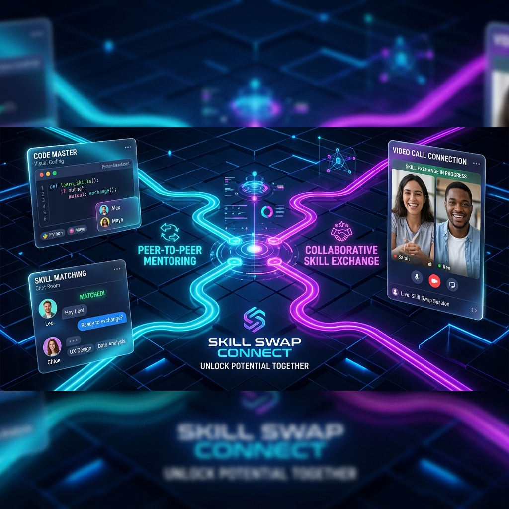
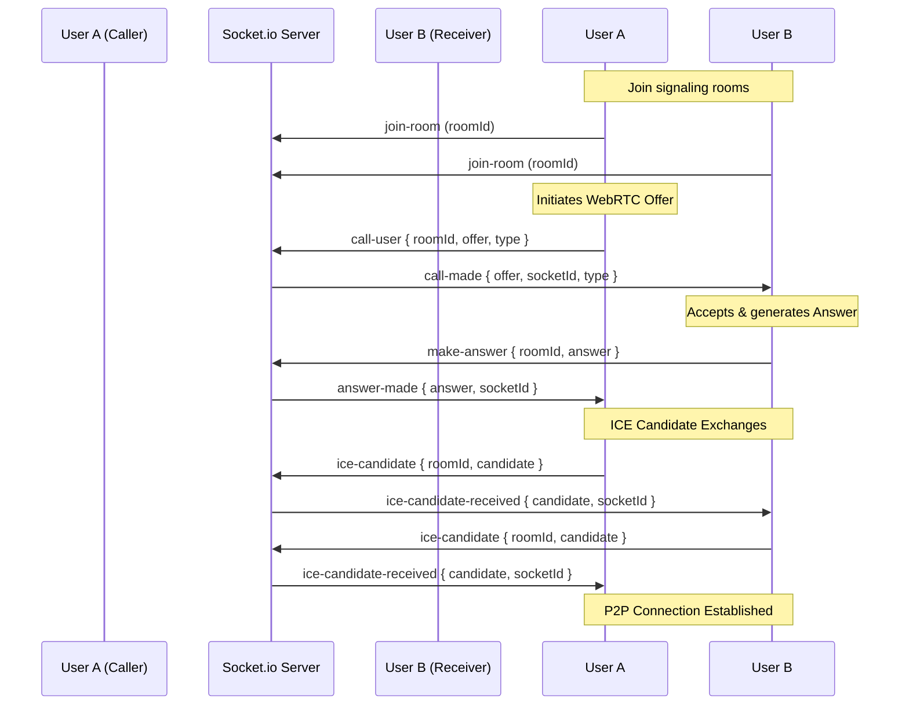

# 🤝 Skill Swap Connect

<div align="center">
  
  
  <p align="center">
    <strong>A high-fidelity peer-to-peer skill exchange platform designed to connect learners and mentors for real-time collaboration, interactive sessions, and community growth.</strong>
  </p>

  [](https://vitejs.dev/)
  [](https://reactjs.org/)
  [](https://www.typescriptlang.org/)
  [](https://tailwindcss.com/)
  [](https://nodejs.org/)
  [](https://expressjs.com/)
  [](https://www.mongodb.com/)
  [](https://socket.io/)
</div>

---

## 📖 Table of Contents

- [🌟 Core Pillars & Features](#-core-pillars--features)
  - [1. User Profiles & Trust Ecosystem](#1-user-profiles--trust-ecosystem)
  - [2. Intelligent Matchmaking](#2-intelligent-matchmaking)
  - [3. Interactive Session Workspace](#3-interactive-session-workspace)
  - [4. Real-time Communication & Audio/Video calling](#4-real-time-communication--audiovideo-calling)
- [🏗️ System Architecture](#️-system-architecture)
- [💻 Tech Stack](#-tech-stack)
- [📂 Project Structure](#-project-structure)
- [🗄️ Database Schemas](#️-database-schemas)
- [🔌 Socket.io Signaling Protocol](#-socketio-signaling-protocol)
- [🚀 Getting Started](#-getting-started)
  - [Prerequisites](#prerequisites)
  - [Zero-Config Database Fallback](#zero-config-database-fallback)
  - [Installation & Set Up](#installation--set-up)
- [📡 API Documentation](#-api-documentation)
- [🧪 Testing](#-testing)
- [🤝 Contributing Guidelines](#-contributing-guidelines)

---

## 🌟 Core Pillars & Features

Skill Swap Connect is structured around four foundational pillars to deliver a premium, seamless, and high-engagement learning experience.

### 1. User Profiles & Trust Ecosystem
* **Dual Roles:** Seamlessly switch between **Learner** and **Mentor** states with specialized attributes.
* **Detailed Portfolios:** Mentors showcase their experience years, teaching styles, availability, and certifications.
* **Reputation & Trust Score:** A dynamic trust tier rating (`New`, `Reliable`, `Verified`) based on community ratings and historical session hours completed.
* **Granular Privacy Controls:** Toggle **Incognito Mode**, control who can send match requests (everyone, verified users, or none), and manage online status visibility.

### 2. Intelligent Matchmaking
* **Bidirectional Matching:** Match users based on the alignment of skills offered and skills wanted.
* **Match Lifecycle:** Interactive workflow representing requests through states: `Pending` ➡️ `Accepted`/`Rejected` ➡️ `Completed`.
* **Mutual Ratings:** Once a match is complete, both the requester and provider write scores and reviews, directly calculating the peer trust score.

### 3. Interactive Session Workspace
A feature-rich "Virtual Session Room" workspace designed to drive collaborative learning:
* **Interactive Timer:** Accumulates active learning time in seconds with start and pause controls.
* **Collaborative Notes:** Real-time markdown notepad for shared documentation and study guides.
* **Resource Manager:** Share external links, file attachments, and video tutorial URLs.
* **Task Checklists:** Interactive list of checkboxes to keep sessions focused and organized.
* **Curriculum Weekly Planner:** A multi-week goal-oriented plan aligning session content with clear outcomes.
* **Milestones & Deadlines:** Long-term target tracking with custom deadlines and progress indicators.
* **Collaborative Whiteboard:** Visual sketching area for explanations, diagramming, and mockups.
* **Agreement Sign-Off:** Establish commitment contracts (e.g., "2 hours/week") signed digitally by both users.
* **Session Health Indicator:** Dynamic health ratings (`Good`, `Attention Required`, `At Risk`) based on activity levels, milestone completion, and overall progress.

### 4. Real-time Communication & Audio/Video calling
* **Instant Text Chat:** Threaded conversation history with read/unread statuses.
* **Media Uploads:** Send images and video files directly in chat.
* **Automatic Contact Sanitizer:** Safeguards users by scanning message contents for email addresses and phone numbers.
* **Moderation Reporting:** Users can flag inappropriate messages directly for admin review.
* **WebRTC Voice & Video:** High-fidelity in-app calling utilizing custom Socket.io signaling rooms.

---

## 🏗️ System Architecture

```mermaid
graph TD
    %% Frontend Components
    subgraph Frontend [React TypeScript Client - SPA]
        A[App Router] --> B[Dashboard]
        A --> C[Browse & Matches]
        A --> D[Virtual Session Room]
        A --> E[Communication Hub]
        
        D --> D1[Shared Notes]
        D --> D2[Collaborative Whiteboard]
        D --> D3[Session Timer]
        D --> D4[Weekly Plan & Milestones]
        
        E --> E1[Text & Media Chat]
        E --> E2[WebRTC Voice/Video Call]
    end

    %% Network & Signaling
    subgraph Signaling & Transports [Signaling / APIs]
        WS[Socket.io Signaling Server]
        HTTP[REST APIs - Axios]
    end
    
    %% Connections
    E2 <-->|WebRTC Handshake/ICE| WS
    E1 <-->|Events| WS
    B & C & D & E -->|JSON Payloads| HTTP

    %% Backend Server
    subgraph Backend [Express Node.js Server]
        HTTP --> Express[Express App]
        WS --> SocketServer[Socket.io Server]
        
        Express --> AuthMW[JWT Auth Middleware]
        Express --> UploadMW[Multer File Uploads]
        
        AuthMW --> Controllers[Controllers: Match, Session, Chat, User]
    end

    %% Database Layer
    subgraph Database [Database Layer]
        Controllers --> DBConn[DB Connector]
        DBConn -->|Default| Atlas[MongoDB Atlas / Local DB]
        DBConn -->|Fallback| InMemoryDB[mongodb-memory-server]
    end

    classDef frontend fill:#2a2b36,stroke:#61dafb,stroke-width:2px,color:#fff;
    classDef backend fill:#1e1e24,stroke:#339933,stroke-width:2px,color:#fff;
    classDef db fill:#111,stroke:#47a248,stroke-width:2px,color:#fff;
    classDef network fill:#000,stroke:#646cff,stroke-width:2px,color:#fff;
    
    class A,B,C,D,E,D1,D2,D3,D4,E1,E2 frontend;
    class Express,SocketServer,Controllers,AuthMW,UploadMW backend;
    DBConn,Atlas,InMemoryDB db;
    WS,HTTP network;
```

---

## 💻 Tech Stack

### Frontend
* **Core:** React 18, TypeScript, Vite
* **State Management & Data Fetching:** React Query (TanStack Query), React Context API
* **UI & Components:** Tailwind CSS, Framer Motion, Lucide React, Shadcn UI primitives (Radix UI)
* **Routing:** React Router DOM (v6)
* **Real-time Client:** Socket.io-client, Axios

### Backend
* **Runtime & Framework:** Node.js, Express.js
* **Database Object Modeling (ODM):** Mongoose (MongoDB)
* **Real-time Server:** Socket.io (WebSocket protocol)
* **Authentication:** JSON Web Tokens (JWT), Bcrypt password hashing
* **File Uploads:** Multer middleware
* **Validation:** Express Validator

---

## 📂 Project Structure

```plaintext
skill-swap-connect/
├── public/                 # Static assets (favicons, banners, SVGs)
├── src/                    # Frontend React Application Source
│   ├── components/         # Reusable Component Primitives
│   │   ├── layout/         # Dashboard layout, Page transitions
│   │   ├── session/        # Timer, Notes, TaskManager, Whiteboard, WeeklyPlan, Milestones
│   │   ├── shared/         # Common UI elements
│   │   └── ui/             # Shadcn primitives (Dialog, Tabs, Button, Progress, Slider)
│   ├── contexts/           # Authentication & Theme Context providers
│   ├── data/               # Mock data & static configurations
│   ├── hooks/              # Custom React hooks (e.g. use-toast)
│   ├── lib/                # API client wrapper & configurations
│   ├── pages/              # Routed pages (Browse, Chat, Dashboard, Journey, Session)
│   ├── App.tsx             # Main routing component
│   └── main.tsx            # React application entry-point
├── server/                 # Backend Node.js Express Application
│   ├── src/
│   │   ├── config/         # MongoDB and Socket connections config
│   │   ├── controllers/    # Route controllers (Auth, Chat, Matches, Sessions, Users)
│   │   ├── middleware/     # Auth checks, upload configurations, error logging
│   │   ├── models/         # Mongoose DB Schemas
│   │   ├── routes/         # Express Router routes mapping
│   │   ├── utils/          # Utility scripts
│   │   ├── app.js          # Express app configurations
│   │   └── server.js       # App starter & Socket.io server connection
│   └── package.json        # Backend dependencies & run scripts
├── package.json            # Frontend dependencies & run scripts
└── tsconfig.json           # TypeScript configuration
```

---

## 🗄️ Database Schemas

The data model consists of 5 core collections designed for relational modeling inside MongoDB:

### 1. User
Stores registration details, profile customizations, trust metrics, and privacy controls:
```typescript
{
  name: { type: String, required: true },
  email: { type: String, required: true, unique: true },
  password: { type: String, required: true, select: false },
  bio: { type: String, default: "" },
  location: { type: String, default: "" },
  skillsOffered: [{ type: String }],
  skillsWanted: [{ type: String }],
  averageRating: { type: Number, default: 0 },
  totalRatings: { type: Number, default: 0 },
  privacySettings: {
    isIncognito: { type: Boolean, default: false },
    allowRequestsFrom: { type: String, enum: ['everyone', 'verified', 'none'] },
    showOnlineStatus: { type: Boolean, default: true }
  },
  trustLevel: { type: String, enum: ['new', 'reliable', 'verified'] },
  stats: {
    totalMinutesLearned: Number,
    totalMinutesTaught: Number,
    sessionsCompleted: Number
  },
  defaultRole: { type: String, enum: ['learner', 'mentor'] },
  mentorProfile: {
    experienceYears: Number,
    teachingStyle: String,
    availability: String,
    linkedinProfile: String,
    certifications: [String]
  }
}
```

### 2. Match
Coordinates connections and ratings between participants:
```typescript
{
  requester: { type: ObjectId, ref: 'User' },
  provider: { type: ObjectId, ref: 'User' },
  skillRequested: { type: String, required: true },
  skillOffered: { type: String, required: true },
  status: { type: String, enum: ['pending', 'accepted', 'rejected', 'completed'] },
  message: String,
  requesterRating: { score: Number, comment: String, ratedAt: Date },
  providerRating: { score: Number, comment: String, ratedAt: Date },
  completedAt: Date
}
```

### 3. Session
Tracks virtual collaboration workspaces:
```typescript
{
  matchId: { type: ObjectId, ref: 'Match', unique: true },
  status: { type: String, enum: ['active', 'paused', 'completed'] },
  startTime: Date,
  accumulatedTime: Number, // seconds
  progress: Number,        // 0-100%
  notes: String,           // Markdown collaborative text
  mentorNotes: String,     // Private notes for the mentor
  resources: [{ title: String, type: String, url: String, addedBy: ObjectId }],
  tasks: [{ title: String, status: String, createdBy: ObjectId }],
  milestones: [{ title: String, description: String, status: String, deadline: Date }],
  weeklyPlan: [{ weekNumber: Number, goals: [String], outcomes: String, status: String }],
  whiteboard: { snapshot: String, updatedAt: Date }, // Base64 Canvas data
  agreement: { goals: String, commitment: String, guidelines: String, acceptedBy: [ObjectId] },
  health: { status: String, score: Number }
}
```

### 4. Message
Manages real-time messages and media:
```typescript
{
  matchId: { type: ObjectId, ref: 'Match' },
  senderId: { type: ObjectId, ref: 'User' },
  type: { type: String, enum: ['text', 'image', 'video', 'system'] },
  content: String,
  media: { filename: String, originalName: String, mimeType: String, size: Number, url: String },
  status: { type: String, enum: ['sent', 'delivered', 'read'] },
  reported: { type: Boolean, default: false },
  reportReason: String,
  deleted: { type: Boolean, default: false }
}
```

### 5. VoiceSession
Manages WebRTC metadata:
```typescript
{
  matchId: { type: ObjectId, ref: 'Match' },
  roomId: { type: String, unique: true },
  initiatedBy: { type: ObjectId, ref: 'User' },
  participants: [{ userId: ObjectId, joinedAt: Date, leftAt: Date, status: String }],
  status: { type: String, enum: ['idle', 'connecting', 'live', 'ended'] },
  startedAt: Date,
  endedAt: Date,
  duration: Number
}
```

---

## 🔌 Socket.io Signaling Protocol

The platform uses WebSockets to coordinate signaling messages during real-time activities and call setups.



---

## 🚀 Getting Started

Follow these steps to set up and run the application locally.

### Prerequisites
* **Node.js** (v18 or higher recommended)
* **NPM** or **Bun** package manager
* **MongoDB** (Optional! The application features an automatic local in-memory DB fallback for easy local developer testing)

### Zero-Config Database Fallback
> [!TIP]
> **No database running? No problem.** If the backend fails to connect to the cloud MongoDB URI (defined in `MONGO_URI`), it automatically launches `mongodb-memory-server` in the background.
> This spins up an in-memory database instance, writing lockfiles under the local `.db-data/` directory.

### Installation & Set Up

#### 1. Clone the repository
```bash
git clone <repository-url>
cd skill-swap-connect
```

#### 2. Install Frontend Dependencies (Root)
```bash
npm install
```

#### 3. Install Backend Dependencies
```bash
cd server
npm install
cd ..
```

#### 4. Configure Environment Variables
Create a `.env` file in the `/server` folder. Refer to `/server/.env.example`:
```env
PORT=5001
MONGO_URI=mongodb://localhost:27017/skillswap
JWT_SECRET=super_secret_jwt_key_here
```

#### 5. Run the Application

**Run the Backend Server:**
```bash
cd server
npm run dev
```
*Server runs on port **5001**.*

**Run the Frontend App (in a separate terminal window):**
```bash
# Return to root directory
npm run dev
```
*Frontend runs on port **5173**.* Open `http://localhost:5173` to access the application.

---

## 📡 API Documentation

All routes are prefix-configured under `/api`. Below are the core endpoints:

| Module | Route | Method | Description | Headers |
| :--- | :--- | :--- | :--- | :--- |
| **Authentication** | `/api/auth/signup` | `POST` | Registers a new user | None |
| | `/api/auth/login` | `POST` | Authenticates user & returns JWT | None |
| | `/api/auth/me` | `GET` | Validates session & gets current user | `Authorization: Bearer <token>` |
| **Users** | `/api/users/onboarding` | `PUT` | Complete onboarding details & roles | `Authorization: Bearer <token>` |
| | `/api/users/profile` | `GET` | Retrieve logged-in profile data | `Authorization: Bearer <token>` |
| | `/api/users/browse` | `GET` | Query users listing with filters | `Authorization: Bearer <token>` |
| **Matches** | `/api/matches/request` | `POST` | Initiate a matching request | `Authorization: Bearer <token>` |
| | `/api/matches` | `GET` | Retrieve matches list (pending/accepted) | `Authorization: Bearer <token>` |
| | `/api/matches/:id/status`| `PATCH`| Accept, reject, or complete match status | `Authorization: Bearer <token>` |
| **Chat** | `/api/chat/:matchId/messages`| `GET`| Retrieve message history | `Authorization: Bearer <token>` |
| | `/api/chat/:matchId/send`| `POST`| Send plain-text chat message | `Authorization: Bearer <token>` |
| | `/api/chat/:matchId/upload`| `POST`| Send media message with image/video | `Authorization: Bearer <token>` |
| **Sessions** | `/api/sessions/:matchId` | `GET` | Fetch session room configurations | `Authorization: Bearer <token>` |
| | `/api/sessions/:matchId/timer`| `POST`| Pause/Resume session duration timer | `Authorization: Bearer <token>` |
| | `/api/sessions/:matchId/tasks`| `POST`| Create a task checklist objective | `Authorization: Bearer <token>` |
| | `/api/sessions/:matchId/notes`| `PUT` | Edit collaborative notes | `Authorization: Bearer <token>` |

---

## 🧪 Testing

The repository contains unit and integration tests written with **Vitest**.

To run all tests:
```bash
npm run test
```

To run tests in watch mode during development:
```bash
npm run test:watch
```

---

## 🤝 Contributing Guidelines

1. **Fork the repository** on GitHub.
2. **Create a branch** for your feature:
   ```bash
   git checkout -b feature/AmazingNewFeature
   ```
3. **Commit your edits** with clean and descriptive messages:
   ```bash
   git commit -m "feat: integrate interactive charts on user dashboard"
   ```
4. **Push to the branch**:
   ```bash
   git push origin feature/AmazingNewFeature
   ```
5. **Submit a Pull Request** describing your additions, screenshots of changes, and manual test validation steps.
